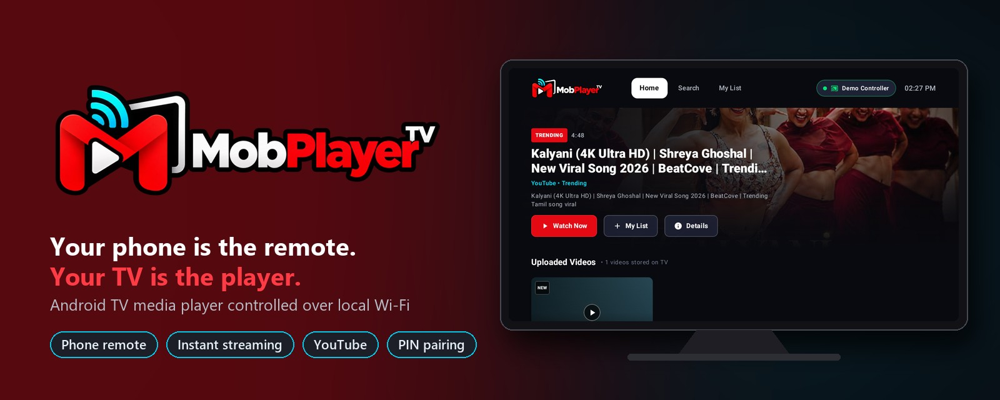
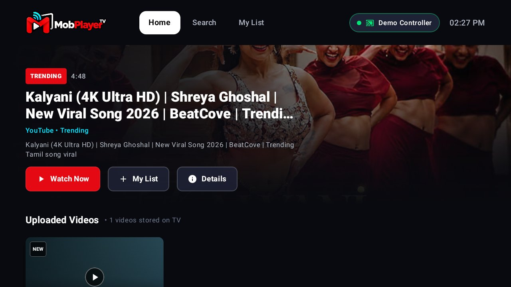
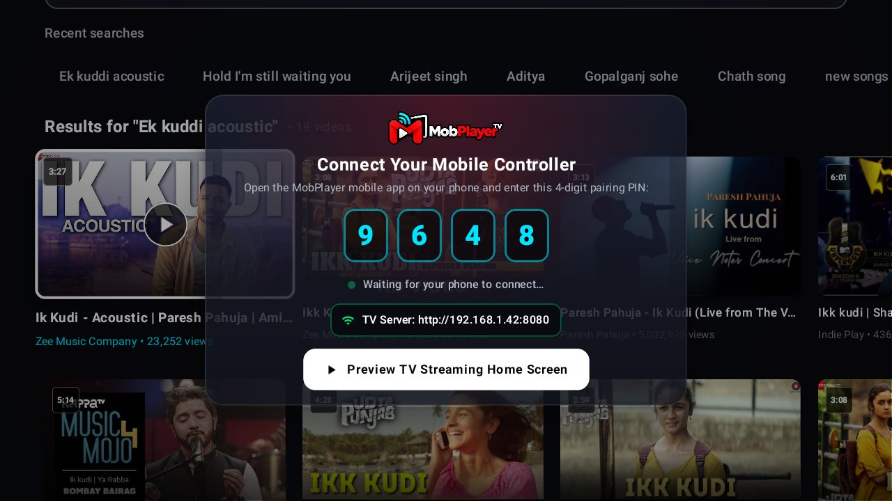
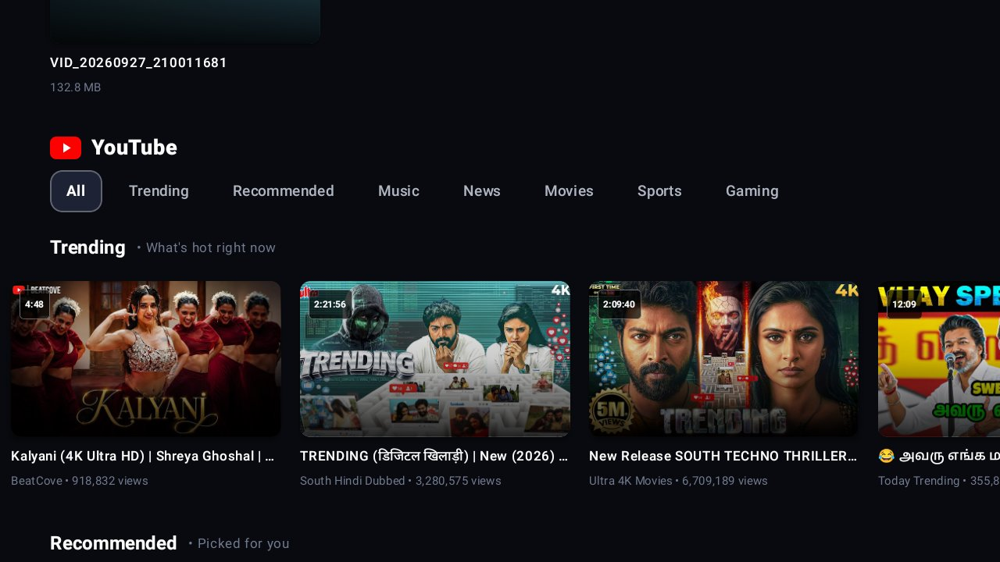
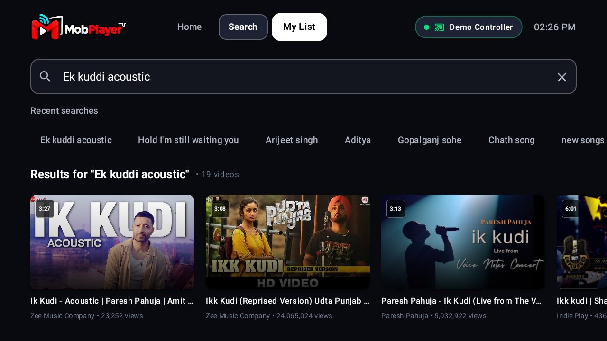
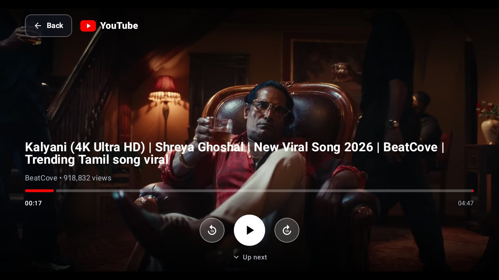
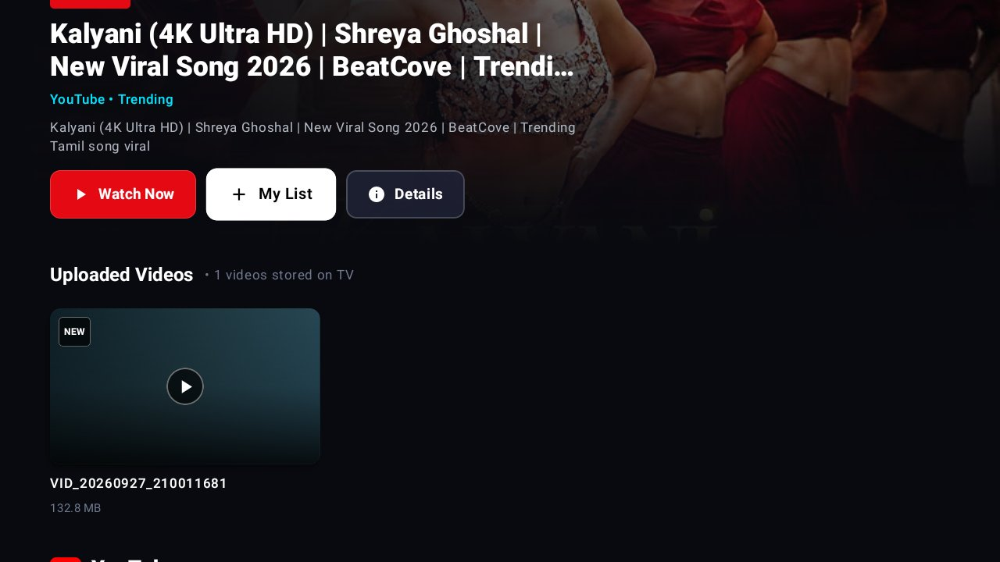
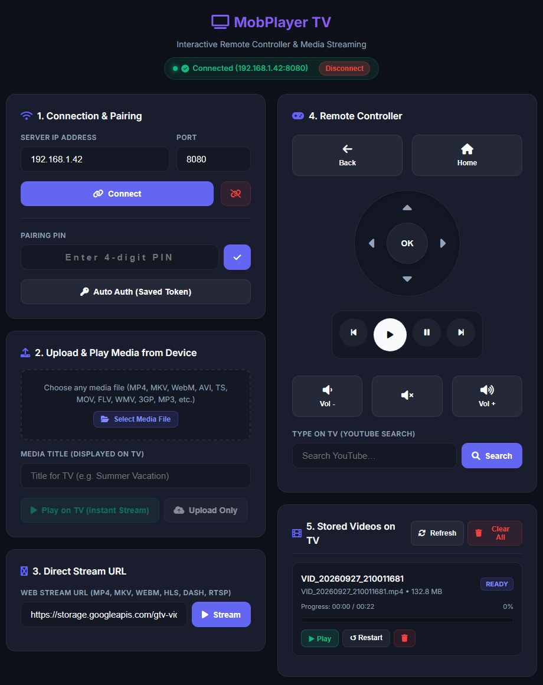

<p align="center">
  
</p>

<p align="center">
  
  
  
  
  
  
  
</p>

# MobPlayer TV

MobPlayer TV is an Android TV app that turns your TV into a media player you control from your phone or a web browser over the local network. It runs an embedded server on the TV. A phone or web controller finds the TV with mDNS, pairs with a 4-digit PIN, and then sends playback commands, videos and links in real time. Remote control does not depend on any cloud service.

The app can also browse, search and play YouTube, and it streams uploaded videos while they are still uploading.

## Contents

- [Screenshots](#screenshots)
- [Features](#features)
- [Tech Stack](#tech-stack)
- [Project Structure](#project-structure)
- [Getting Started](#getting-started)
- [API Overview](#api-overview)
- [Security](#security)
- [Known Limitations](#known-limitations)
- [Troubleshooting](#troubleshooting)
- [Testing](#testing)
- [License & Credits](#license--credits)

---

## Screenshots

<table>
  <tr>
    <td width="50%"><br><b>Home</b>: hero billboard, tabs and live controller status</td>
    <td width="50%"><br><b>Pairing</b>: 4-digit PIN and the TV's server address</td>
  </tr>
  <tr>
    <td><br><b>YouTube feed</b>: Trending, Music, News, Movies and more</td>
    <td><br><b>Search</b>: type on the phone, results appear on the TV</td>
  </tr>
  <tr>
    <td><br><b>Player</b>: timeline, ±10 s seek and "Up next"</td>
    <td><br><b>Uploaded videos</b>: files sent from the phone, stored on the TV</td>
  </tr>
</table>

### Web controller

Open `http://<TV_IP>:8080/` in any browser on the same network to get a full remote: pairing, D-pad, playback and volume, YouTube search, uploads, stream URLs and the stored-video library.

The page is [`test_client.html`](test_client.html) at the repo root. A Gradle task (`syncTestClientAssets` in [`app/build.gradle.kts`](app/build.gradle.kts)) copies it into the APK's assets at build time, so edit the root file and rebuild.

<p align="center">
  
</p>

---

## Features

### Phone / web remote control
- **Automatic discovery**: the TV advertises itself on the LAN as `MobPlayer TV` (`_mobplayer._tcp.`) using Android NSD (mDNS), so controllers find it without typing an IP address.
- **WebSocket control channel**: `ws://<TV_IP>:8080/control` handles play, pause, seek, volume, D-pad navigation and text input.
- **Live state sync**: the TV pushes playback state (playing/paused, position, volume) to the controller as `STATE_UPDATE` messages.
- **Text input from the phone**: typing on the phone fills the TV's YouTube search box.

### PIN pairing
- A 4-digit PIN appears on the TV the first time a device connects.
- After pairing, the device gets a long-lived token stored in `EncryptedSharedPreferences`, so it reconnects without the PIN.
- Only one controller can be active at a time. When a second device connects, the TV asks whether to **Allow** or **Reject** it.
- Pairing is meant for a trusted home network. See [Security](#security) for its limits.

### Upload & instant streaming
- **Play while uploading**: `POST /api/upload` accepts raw binary or `multipart/form-data` uploads. Playback starts after the first ~64 KB arrive, served through `GET /api/stream/{uploadId}`.
- **Fast-start buffering**: ExoPlayer is tuned for a quick first frame (250 ms initial buffer).
- **Large MKV support**: growing MKV uploads skip the end-of-file Cues seek and use longer timeouts, so big files don't time out.
- **Video library**: uploaded videos are saved on the TV with title, size, duration and watch progress, and appear in a "Continue Watching" rail.
- **Auto-resume**: stored videos resume from where you last stopped watching.
- **Library management**: list, play, delete or clear stored videos through the REST API.

### Wide format support
- Containers: MP4, MKV, WebM, MPEG-TS, AVI, MOV, FLV, WMV, 3GP, Ogg.
- Streaming protocols: HLS (`.m3u8`), DASH (`.mpd`), RTSP.
- Audio: MP3, AAC, FLAC, WAV, Opus.
- Cast any media URL from the phone (`LOAD_MEDIA`).

### YouTube
- Home feed, categories and search, powered by the bundled `youtubecrawler` module.
- Stream deciphering through the MediaServiceCore libraries from SmartTube (`app/libs/`), with fallback from HLS for live, to DASH, to progressive streams.
- YouTube uses the same player as uploads, so the phone remote works the same way for both.

> **Disclaimer:** MobPlayer TV is not affiliated with, endorsed by, or sponsored by YouTube or Google. You are responsible for following YouTube's [Terms of Service](https://www.youtube.com/t/terms) when you use the YouTube features.

### TV-first UI
- Built entirely with Jetpack Compose and designed for D-pad focus navigation.
- Hero billboard, content rails, media cards, player overlay with timeline, and a remote-action HUD.
- The player can minimise to the background while you browse.
- The screen stays on during playback.

### Reliable background server
- The Ktor server runs inside a foreground service, so Android doesn't kill it.
- Network changes (Wi-Fi ↔ Ethernet, IP changes) are detected, and the server and mDNS broadcast restart automatically.

---

## Tech Stack

| Area | Technology |
| :--- | :--- |
| Language | Kotlin, Coroutines & Flow |
| UI | Jetpack Compose, Material 3, Coil |
| Playback | AndroidX Media3 (ExoPlayer, HLS, DASH, RTSP, MediaSession) |
| Server | Ktor 2.3 (CIO engine, WebSockets) |
| Serialization | kotlinx.serialization |
| DI | Dagger Hilt |
| Security | AndroidX Security (`EncryptedSharedPreferences`) |
| Discovery | Android NSD (mDNS) |
| YouTube | `youtubecrawler` module + MediaServiceCore AARs |

**Requirements:** Android 8.0+ (minSdk 26, targetSdk 36), JDK 17.

---

## Project Structure

```
MobPlayerTv/
├── app/                      # Android TV application
│   ├── libs/                 # Prebuilt AARs (MediaServiceCore, J2V8, commons-io)
│   └── src/main/java/com/mobplayer/tv/
│       ├── auth/             # PIN + token authentication
│       ├── data/             # UI data models (media items)
│       ├── models/           # WebSocket, remote-action and video metadata models
│       ├── network/          # NSD discovery, network monitoring
│       ├── server/           # Ktor HTTP/WebSocket server
│       ├── service/          # Foreground service hosting the server
│       ├── storage/          # Upload & progressive stream management
│       ├── repository/       # Media, server and YouTube repositories
│       ├── youtube/          # YouTube player engine
│       ├── viewmodel/        # ViewModels
│       └── ui/               # Compose screens & components
├── youtubecrawler/           # YouTube feed/search/stream extraction library
├── docs/images/              # README banner & screenshots
├── api_contracts/            # Per-endpoint API specifications
├── APP_CONTROL_CONTRACT.md   # Full controller protocol spec
├── test_client.html          # Web controller (bundled into the APK)
└── forward-tv-port.{ps1,sh}  # Expose an emulator to the LAN
```

---

## Getting Started

### Build & install

```bash
# Windows: gradlew.bat
./gradlew installDebug
```

Or open the project in Android Studio and run the `app` configuration on an Android TV device or emulator.

### Connect a controller

1. Launch MobPlayer TV on the TV.
2. On a device on the same network, open `http://<TV_IP>:8080/` in a browser to load the built-in web controller (or use the companion mobile app).
3. Click **Connect** and enter the PIN shown on the TV.
4. Control playback, upload a video, or cast a URL.

### Using an emulator

An emulator isn't reachable from the LAN by default. The forwarding scripts relay `LAN:18081 → localhost:18080 → Android:8080`. After running one, open `http://<PC_LAN_IP>:18081/` from your phone.

#### Windows

Run in an Administrator PowerShell with the emulator and the app already open:

```powershell
powershell -NoProfile -ExecutionPolicy Bypass -File .\forward-tv-port.ps1
```

The relay and firewall rule persist. Cleanup commands are in the script's header.

#### macOS

Requires Android SDK Platform-Tools (`adb`) and `socat` (`brew install socat`):

```bash
bash ./forward-tv-port.sh
```

Keep the terminal open. Ctrl+C stops the relay.

---

## API Overview

| Endpoint | Method | Purpose |
| :--- | :---: | :--- |
| `/control` | WebSocket | Pairing, remote commands, live state |
| `/api/upload` | POST | Upload a video (optionally play immediately) |
| `/api/stream/{uploadId}` | GET | Progressive stream of an in-progress upload |
| `/api/videos` | GET | List stored videos with progress |
| `/api/videos/{fileName}` | GET | Stream/download a stored video |
| `/api/videos/{id}/play` | POST | Play or resume a stored video |
| `/api/videos/{id}` | DELETE | Delete one video |
| `/api/videos` | DELETE | Clear the library |

REST calls authenticate with an `X-Auth-Token` header or a `?token=` query parameter. See [`api_contracts/`](api_contracts/README.md) and [`APP_CONTROL_CONTRACT.md`](APP_CONTROL_CONTRACT.md) for full request/response details.

---

## Security

MobPlayer TV is built for a **trusted home LAN**. Keep these limits in mind:

- **No encryption.** All traffic is plain HTTP and WebSocket (`http://`, `ws://`). Anyone on the same network can observe it.
- **Tokens can leak.** A token passed as `?token=` may end up in browser history, proxy logs or server logs. Prefer the `X-Auth-Token` header.
- **Weak PIN.** The PIN has 4 digits, isn't generated with `SecureRandom`, and has no attempt limit or lockout yet, so someone on the LAN could brute-force it.
- **Don't expose port 8080 to the internet.** Don't port-forward it on your router or run the app on public or shared Wi-Fi.

---

## Known Limitations

- **One controller at a time.** A second device must be allowed on the TV, which disconnects the first.
- **No mDNS through the emulator relay.** When you use `forward-tv-port`, enter the address manually.
- **Seeking in growing MKV uploads.** An MKV played while it uploads can't be seeked until it's replayed from storage. MP4s with the `moov` atom at the end wait for most of the upload before playing.
- **Device decoder limits.** Uploaded or cast files beyond the TV's decoder capabilities (for example, some 4K H.264 High@5.1 files) may start and then fail mid-playback.

---

## Troubleshooting

**The phone app can't find the TV.**
- Make sure the phone and TV are on the same network and subnet. Guest networks and some mesh or extender setups put devices on different subnets.
- Many routers and access points block mDNS or enable *client/AP isolation*. Turn isolation off, or connect manually with `http://<TV_IP>:8080/`. The TV's address appears on the pairing screen.

**The browser can't open `http://<TV_IP>:8080/`.**
- Check that the app is open on the TV. The server runs as a foreground service while the app is active.
- Make sure no VPN on the phone or PC is routing LAN traffic elsewhere.

**Emulator relay isn't reachable.**
- *Windows:* the script must run in an **Administrator** PowerShell. Rerun it after restarting ADB or the emulator. If your Wi-Fi address changed, remove the old relay first (see the script header).
- *macOS:* if a firewall prompt appears for `socat`, allow incoming connections. Don't disable the firewall.
- If several network interfaces are active, pass `-ListenAddress` (Windows) or `--listen-address` (macOS).

**Pairing keeps asking for a PIN.** Clear the saved token in the controller and pair again. Tokens are tied to the TV app's storage and are lost if the app's data is cleared.

---

## Testing

```bash
./gradlew test                  # Unit tests
./gradlew connectedAndroidTest  # Instrumentation tests (device/emulator)
```

Coverage is currently small:

- **Unit:** `ServerRepositoryTest` and `VideoUploadManagerTest` in `app`, and `FormatUtilsTest` in `youtubecrawler`.
- **Instrumentation:** `AuthManagerTest`.

---

## License & Credits

MobPlayer TV is released under the [MIT License](LICENSE).

The app bundles prebuilt third-party libraries in `app/libs/`. They keep their own licenses:

| Library | Files | License |
| :--- | :--- | :--- |
| [MediaServiceCore](https://github.com/yuliskov/MediaServiceCore) by yuliskov (from the [SmartTube](https://github.com/yuliskov/SmartTube) project) | `youtubeapi`, `mediaserviceinterfaces`, `sharedutils` AARs | No license declared in its repository; [SmartTube](https://github.com/yuliskov/SmartTube) itself is MIT |
| [J2V8](https://github.com/eclipsesource/J2V8) | `j2v8-release.aar` | Eclipse Public License 1.0 |
| [Apache Commons IO](https://commons.apache.org/proper/commons-io/) | `commons-io-2.8.0-release.aar` | Apache License 2.0 |

Thanks to the SmartTube project for its YouTube stream-deciphering work.
